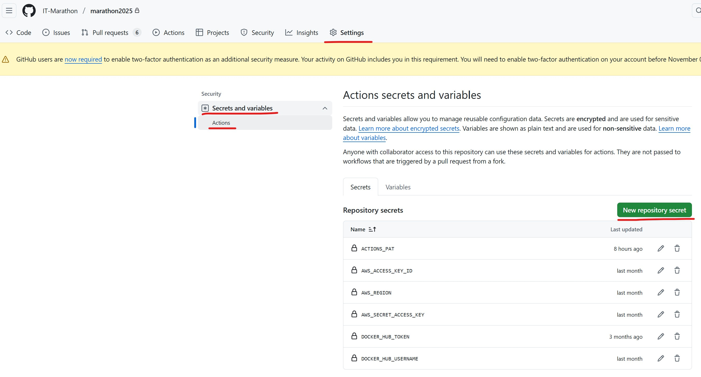
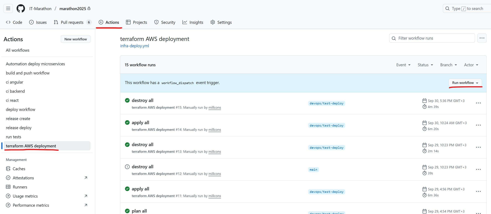

## Prerequisites

Before starting, ensure the following prerequisites are met:
1. AWS Account:
 - Access to an AWS account with IAM permissions to create resources.
 - (Optional if you want to use AWS CLI) AWS CLI installed and configured locally.

2. Terraform (1.13 or higher) installed on your local machine if you plan to deploy manually.

3. A GitHub repository to host GitHub actions and application files.

4. GitHub Actions enabled in your repository.

5. AWS S3 Bucket for terraform remote state file

6. Create access keys/IAM for Terraform

## Preparations

All steps can be performed in any order

### AWS S3 Bucket for Remote State

- Visit Management Console, then click on S3.


- Click on 'Create bucket'


- Give your bucket a name, enable versioning if you want, and click on 'Create bucket' below. Once it created, write down it's name in backend.tf file.


### Create access keys/IAM for Terraform

- Visit Management Console, then click on IAM.


- Click on 'Create user'

- At Step 1, specify user's name, click 'Next'

- At Step 2, click on 'Attach policies directly' and look for a policy 'AdministratorAccess'. Select it, then click 'Next'.


- On the final step, click Create user.

Once the user is created, go to it's settings and click on 'Security credentials'


Find 'Create access keys' button below and click on it.
- Specify 'Command Line Interface' as Use Case when presented, click on 'Confirmation' checkbox and click on 'Next'. Download the generated keys as a CSV file on the final screen.

### Set up GitHub Secrets

To securely store sensitive credentials (like AWS keys) for GitHub Actions, add the following secrets to your repository:

1. Go to your GitHub repository on GitHub.com.
2. Click on the **Settings** tab.
3. In the left sidebar, expand **Secrets and variables** and click **Actions**.
4. Under **Secrets**, click **New repository secret**.
5. For each secret below, add a new one with the exact name (e.g., `AWS_ACCESS_KEY_ID`), paste the value (from your AWS CSV or other sources), and click **Add secret**.

| Secret Name            | Description |
|------------------------|-------------|
| AWS_ACCESS_KEY_ID     | AWS IAM access key ID for authentication (from CSV). |
| AWS_REGION            | AWS region to deploy resources (e.g., `eu-central-1`). |
| AWS_SECRET_ACCESS_KEY | AWS IAM secret access key for authentication (from CSV). |
| DOCKER_HUB_TOKEN      | Personal access token for Docker Hub authentication. |
| DOCKER_HUB_USERNAME   | Docker Hub username for pushing/pulling images. |
| ACTIONS_PAT   | GitHub Personal Access Token. |



## Deploy via GitHub Actions

GitHub Actions runs the "terraform AWS deployment" workflow to manage AWS resources.

### Steps to Run the Workflow

1. Go to your repository on GitHub.com.

2. Click on the **Actions** tab (in the top menu).

3. In the left panel, select the **terraform AWS deployment** workflow 

4. Click the green **Run workflow** button (top right).

5. In the popup window, select parameters:
   - **module**: What to deploy? Choose `all` for everything or a specific module, e.g.:
     - `vpc` — network.
     - `sg` — security groups.
     - `ec2` — virtual machines.
     - `alb` — load balancer.
     - `rds` — database.
   - **action**: What action?
     - First, choose **`plan`** — preview changes (safe!).
     - If the plan is OK, run again with **`apply`** — apply changes (creates resources!).
     - (Optional) `destroy` — delete everything (use carefully).

6. Click **Run workflow**. The workflow will start!

7. Go back to the **Actions** tab and select your run. Click on it to see logs (execution steps). Here you'll see:
   - **Terraform Init**: Automatic setup.
   - **Terraform Plan** (for plan): List of resources to create (green = add, yellow = change).
   - **Terraform Apply** (for apply): Actual creation + plan before it.

If there are errors (red status), check secrets, `backend.tf` file (S3 bucket name), and `terraform.tfvars`. Run plan again.



## Deploy manually using Terraform locally
1. Create .aws/credentials file in your home directory (Linux/WSL) and copy the content of the CSV file you downloaded before. Your file should look like this:
```
[default]
aws_access_key_id=ASIA...
aws_secret_access_key=wJalrXUt...
```
2. Copy the created s3 bucket name to backend.tf file, after that run the command:
```
terraform init ---backend-config=backend.tf
```
- You shall get a message that the backend succesfully initialized and your bucket has a tfstate file now.

3. Check the content of [terraform.tfvars](terraform.tfvars) file to make sure it has values you need. 

Now you're ready to deploy and you can proceed with a `terraform plan` and `terraform apply` commands.

- Run `terraform plan` to see what will be created and if there any errors
- If the previous command didn't produce any errors, run `terraform apply` to deploy all components or use -target flag to specify modules/parts to deploy.

## Links

https://developer.hashicorp.com/terraform/language/backend/s3

https://developer.hashicorp.com/terraform/

https://developer.hashicorp.com/terraform/cli/commands/init

https://developer.hashicorp.com/terraform/cli/commands/plan

https://docs.aws.amazon.com/cli/v1/userguide/cli-configure-files.html
