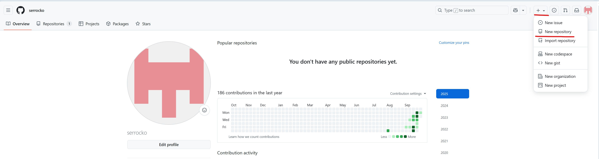
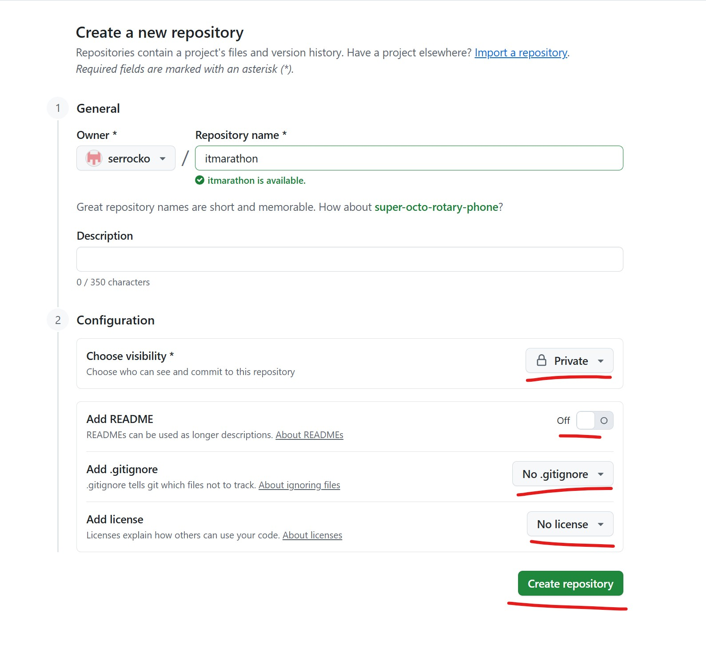
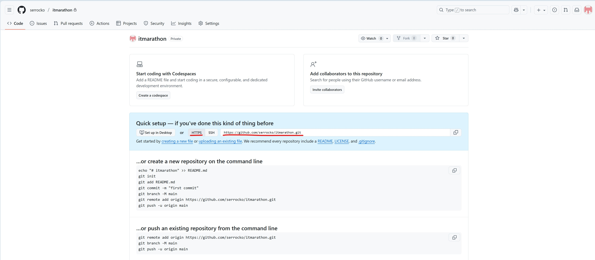
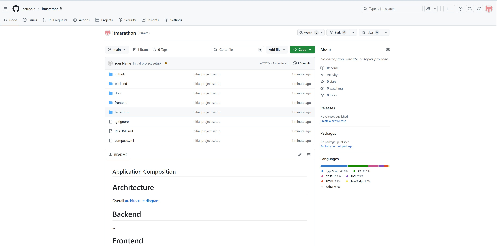

# How to upload Project on GitHub

## Step 1: Download the Project as a ZIP Archive

First, you need to download all the project files from the original repository to your computer. **Check your email** for the invitation message from the IT-Marathon team. It will contain a direct download link to the ZIP archive.

### Option A: Linux Console (Terminal)

If you prefer working in the terminal, this is the fastest method:

1. **Open Terminal** (Ctrl+Alt+T)

2. **Navigate to your desired folder** (e.g., Downloads):
   ```bash
   cd ~/Downloads
   ```

3. **Download the ZIP archive** using wget:
   ```bash
   wget -O marathon2025.zip "YOUR_DOWNLOAD_LINK_FROM_EMAIL"
   ```
   *Replace `YOUR_DOWNLOAD_LINK_FROM_EMAIL` with the actual link from your email.*

4. **Install unzip** if not already installed:
   ```bash
   sudo apt-get install unzip
   ```

5. **Extract the archive:**
   ```bash
   unzip marathon2025.zip
   ```

6. **Navigate into the extracted folder:**
   ```bash
   cd marathon2025.git
   ```

**Done!** You can now proceed to Step 2.

---
<br>
<br>
<br>

### Option B: Windows (File Explorer)

1. **Click the download link** in your email. The browser will download the ZIP file to your "Downloads" folder.

2. **Open File Explorer** (Win + E) and go to "Downloads".

3. **Right-click on the ZIP file** → Select **Extract All...** → Click **Extract**.

---

### Option C: Linux (File Manager)

1. **Click the download link** in your email. The browser will download the ZIP file to your "Downloads" folder.

2. **Open File Manager** and go to "Downloads".

3. **Right-click on the ZIP file** → Select **Extract Here**.

---

## Step 2: Create a New Repository on Your Own GitHub Account

Now you need to create an empty repository on your account where you will upload the project files.

1. **Log in to your GitHub account** at [github.com](https://github.com)

2. **Click the "+" icon** in the top-right corner, next to your profile picture.

3. **Choose "New repository"** from the dropdown menu.

   

4. **Fill in the new repository information:**
   - **Repository name:** Enter a name for your project (e.g., `itmarathon`)
   - **Description (optional):** Add a short description of the project
   - **Public/Private:** Choose **Private** to make your repository not visible to everyone
   
   **IMPORTANT:** Do not check the boxes for "Add a README file", "Add .gitignore", or "Choose a license". The repository must be completely empty.

<div style="page-break-before: always;"></div>

5. **Click the "Create repository" button.**

   

---

## Step 3: Upload the Project Files to Your New Repository

### 3.1. Install Git (if not already installed)

   **Windows:**

   - Download Git from https://git-scm.com/download/win
   - Run the installer and click "Next" through all steps (default settings are fine)
   - After installation, open **Git Bash** (search for "Git Bash" in Start menu)

   **Linux:**

   - Open **Terminal**
   - Run the command:
   ```bash
   sudo apt-get install git
   ```
   - Enter your password when prompted

### 3.2. Navigate to the Mirror Repository Folder

1. **Find the full path to your extracted folder:**
   - **Windows:** Open the folder in File Explorer, click on the address bar at the top, and copy the path (e.g., `C:\Users\YourName\Downloads\marathon2025.git`)
   - **Linux:** Open the folder in File Manager, right-click and select "Properties" to see the path (e.g., `/home/yourname/Downloads/marathon2025.git`)

2. **Open the terminal:**
   - **Windows:** Open **Git Bash** (search in Start menu)
   - **Linux:** Open **Terminal** (Ctrl+Alt+T)

3. **Navigate to the folder** by typing `cd` followed by the path:
   
   **Windows example:**
   ```bash
   cd /c/Users/YourName/Downloads/marathon2025.git
   ```
   
   **Linux example:**
   ```bash
   cd /home/yourname/Downloads/marathon2025.git
   ```
   
   Press **Enter**.

### 3.3. Configure Git (First Time Only)

If this is your first time using Git, you need to tell it who you are:

```bash
git config --global user.name "Your Name"
git config --global user.email "your.email@example.com"
```

Replace with your actual name and the email you use for GitHub.

### 3.4. Create a Personal Access Token (Required for Authentication)

GitHub requires a Personal Access Token for pushing code. Let's create one:

1. **Go to GitHub Settings:**
   - Click your profile picture in the top-right corner
   - Select **Settings**
   - Scroll down and click **Developer settings** (at the bottom of the left sidebar)
   - Click **Personal access tokens** → **Tokens (classic)**

2. **Generate new token:**
   - Click **Generate new token** → **Generate new token (classic)**
   - **Note:** Enter a description like "Marathon 2025 Upload"
   - **Expiration:** Select 90 days (or custom date)
   - **Select scopes:** Check only **repo** and **workflow** (this will check all sub-options)
   - Scroll down and click **Generate token**

3. **IMPORTANT:** Copy the token immediately! It looks like `ghp_xxxxxxxxxxxxxxxxxxxx`. You won't be able to see it again. Save it in a safe place temporarily.

### 3.5. Upload the Mirror Repository to GitHub

1. **Push all branches, tags, and history to your repository:**
   ```bash
   git push --mirror https://github.com/YOUR-USERNAME/itmarathon.git
   ```
   
   **Important:** Replace `YOUR-USERNAME` with your actual GitHub username and `itmarathon` with your repository name!
   
   **Tip:** You can copy this URL from your empty repository page on GitHub.

   

2. **When prompted for credentials:**
   - **Username:** Enter your GitHub username
   - **Password:** Paste your Personal Access Token (the one you just created, starting with `ghp_`)
   
   **Note:** When you paste the token, you won't see it on screen - this is normal for security reasons. Just paste it and press Enter.

### 3.6. Verify the Upload

Go to your repository page on GitHub and refresh it. You should now see all the project files, complete commit history, and all branches! Next manuals you will find on the front page of your repository.



---

## Done!